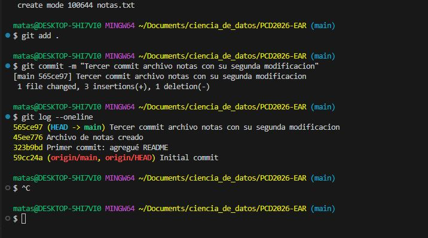

# Documentación: Creación de un Repositorio Local

## Pasos realizados

1. **Inicializar el repositorio**
    ```bash
    git init
    ```

2. **Crear archivos requeridos**
    - `README.md`
    - `notas.txt`

3. **Agregar archivos al área de staging y realizar el primer commit**
    ```bash
    git add .
    git commit -m "Primer commit: agregué README"
    ```

4. **Agregar archivo de notas y realizar el segundo commit**
    ```bash
    git add .
    git commit -m "Archivo de notas creado"
    ```

5. **Modificar notas.txt y realizar el tercer commit**
    ```bash
    git add .
    git commit -m "Tercer commit archivo notas con su segunda modificacion"
    ```

6. **Ver historial de commits**
    ```bash
    git log --oneline
    ```

## Captura de pantalla del comando

